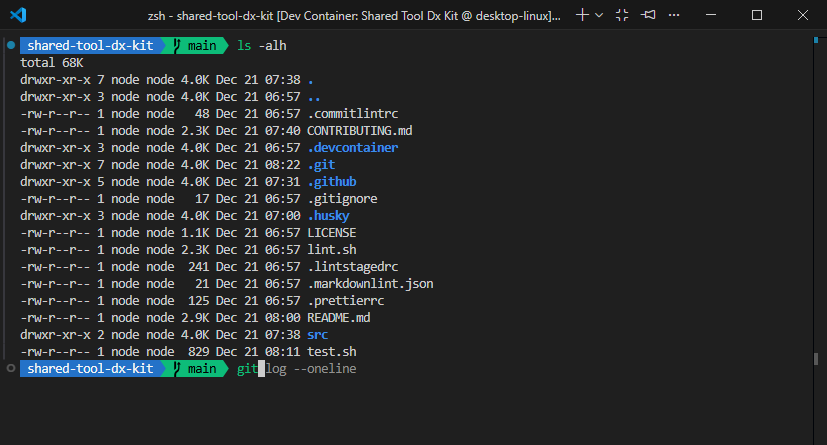

<!-- markdownlint-disable -->

  

<!-- markdownlint-restore -->

# Ecoma Profile Repository

This repository provides common contribute guide, ecoma's profile page and prebuild devcontainer
image used across ecoma's repositories.

## Devcontainer Prebuild Image

The devcontainer in this repository provides a pre-configured development environment for shared use
across ecoma projects, with a strong focus on container, cloud, and CI/CD tooling.

**Highlights include:**

- **Operating System**: Ubuntu (Microsoft Dev Containers base image)
- **Shell & Prompt**:
  - Zsh with Oh My Zsh (custom plugins: git, git-auto-fetch, zsh-syntax-highlighting,
    zsh-autosuggestions, you-should-use)
  - Powerlevel10k theme (custom feature)
- **Build & Lint Tools**:
  - Pants build system (custom feature)
  - Lefthook (pre-commit hooks)
  - Dprint (code formatter)
  - Conform (conventional commit linter)
  - Shellcheck, shfmt (shell lint/format)
  - Hadolint (Dockerfile linter)
  - Checkov (infrastructure as code scanner)
  - Trivy (container vulnerability scanner)
  - Dive (container image explorer)
  - Dockle (container image linter, custom feature)
  - actionlint (GitHub Actions workflow linter, custom feature)
  - Gitleaks (secrets scanner)
  - Ansible & ansible-lint
  - Terraform
  - Kustomize, K3d, Kubectl, Helm, Kubeseal (Kubernetes tools)
- **Languages & Runtimes**:
  - Go (latest, with go-packages: lefthook, conform, shfmt)
  - Node.js (LTS)
- **Other Pre-installed Tools**:
  - Docker (docker-in-docker)
  - yq, jq, unzip, zip, iputils-ping
- **`unified-cache` feature**:
  - This repository now includes a unified cache feature which provides a cache for common
    dependencies to speed up development. See
    [.devcontainer/features/unified-cache/README.md](.devcontainer/features/unified-cache/README.md)
    for more details
  - Support caching for npm, pnpm, yarn, terraform, ansible, python (pip), go (build & module),
    dprint

**Using prebuild image** Use image for devcontainer or create image base on
`ghcr.io/ecoma-io/devcontainer`

## Contributing

If you want to contribute, open an issue or a PR describing your change. Keep changes focused and
add tests for new behaviors.

Follow [Contributing Guide](CONTRIBUTING.md)

## License

This project is licensed under the MIT License. See the [LICENSE](LICENSE.md) for more details.
